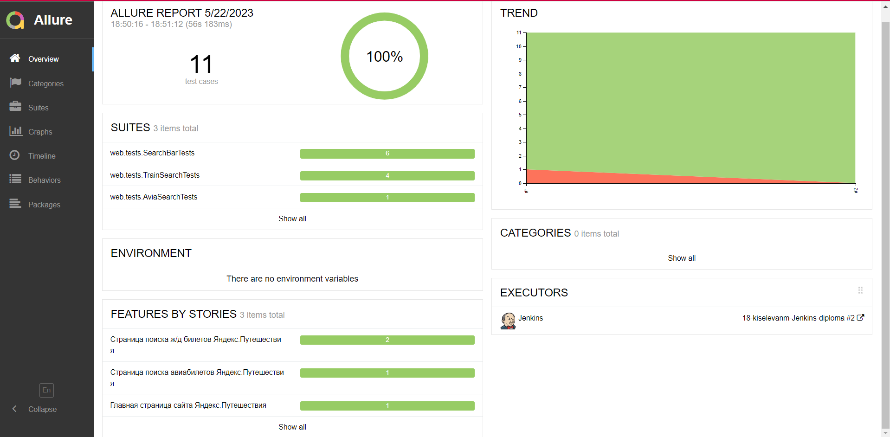
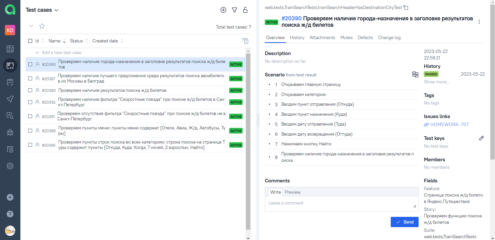

# Проект по автоматизации тестирования страницы Jetbrains Products
## :pushpin: Содержание:

- [Использованный стек технологий](#computer-использованный-стек-технологий)
- [Запуск тестов](#running_woman-запуск-тестов)
- [Список тестов](#bookmark_tabs-список-тестов)
- [Сборка в Jenkins](#-сборка-в-jenkins)
- [Пример Allure-отчета](#-пример-allure-отчета)
- [Интеграция с Allure TestOps](#-интеграция-с-allure-testops)
- [Интеграция с Jira](#-интеграция-с-jira)
- [Уведомления в Telegram с использованием бота](#-уведомления-в-telegram-с-использованием-бота)
- [Видео-пример запуска теста в Selenoid](#-видео-примера-запуска-теста-в-selenoid)

## :computer: Использованный стек технологий

<p align="center">


</p>

Автотесты написаны на <code>Java</code> с использованием <code>JUnit 5</code> и <code>Gradle</code>.
Для UI-тестов использован фреймворк [Selenide](https://selenide.org/).
Запуск тестов можно осуществлять локально или с помощью [Selenoid](https://aerokube.com/selenoid/).
Также реализована сборка в <code>Jenkins</code> с формированием Allure-отчета и отправкой уведомления с результатами в <code>Telegram</code> после завершения прогона.

Allure-отчет включает в себя:
* шаги выполнения тестов;
* скриншот страницы в браузере в момент окончания автотеста;
* исходный код страницы;
* логи браузерной консоли;
* видео выполнения автотеста.


## :bookmark_tabs: Список тестов:
* Проверки блока поиска на главной странице:
  * Проверка категорий в блоке поиска;
  * Проверка полей поиска в каждой категории;
* Проверка функции поиска в категории "Авиа":
  * Проверка наличия лучшего предложения (по цене) среди результатов поиска авиабилетов из Москвы в Белград
* Проверки в категории "Ж/д":
  * Проверки отображения фильтра "Скоростные поезда":
    * Проверка наличия фильтра "Скоростные поезда" при поиске ж/д билетов в Санкт-Петербург
    * Проверка отсутствия фильтра "Скоростные поезда" при поиске ж/д билетов не в Санкт-Петербург
  * Проверки функции поиска в категории "Ж/д"
    * Проверка наличия результатов поиска ж/д билетов
    * Проверка наличия города-назначения в заголовке результатов поиска ж/д билетов

## :running_woman: Запуск тестов

### Локальный запуск тестов
```
gradle clean test -Denv=local
```

### Запуск тестов на удаленном браузере
<code>REMOTE_URL</code> - адрес удаленного сервера, на котором будут запускаться тесты.
```
gradle clean test -Denv=remote -DremoteUrl=${REMOTE_URL}
```

##  Сборка в Jenkins

<p align="center">

</p>

1.  Открыть <a target="_blank" href="https://jenkins.autotests.cloud/job/18-kiselevanm-Jenkins-diploma/">**сборку в Jenkins**</a>
2. В боковом меню выбрать пункт **"Собрать с параметрами"**
3. Выбрать параметры из выпадающих списков
4. Нажать кнопку **"Собрать"**
5. После прогона тестов в блоке **"История сборок"** появятся ссылки на **Allure-отчет** и на **Allure TestOps**


##  Пример Allure-отчета
### Overview

<p align="center">

</p>

### Результат выполнения теста

<p align="center">

</p>

##  Интеграция с Allure TestOps

## Главный дашборд

<p align="center">

</p>

## Результаты выполнения тестов

<p align="center">

</p>

##  Интеграция с Jira

<p align="center">

</p>


###  Уведомления в Telegram с использованием бота

После завершения сборки специальный бот, созданный в <code>Telegram</code>, автоматически обрабатывает и отправляет сообщение с отчетом о прогоне.

<p align="center">

</p>

###  Видео примера запуска теста в Selenoid

К каждому тесту в отчете прилагается видео. Одно из таких видео представлено ниже.
<p align="center">
  
</p>